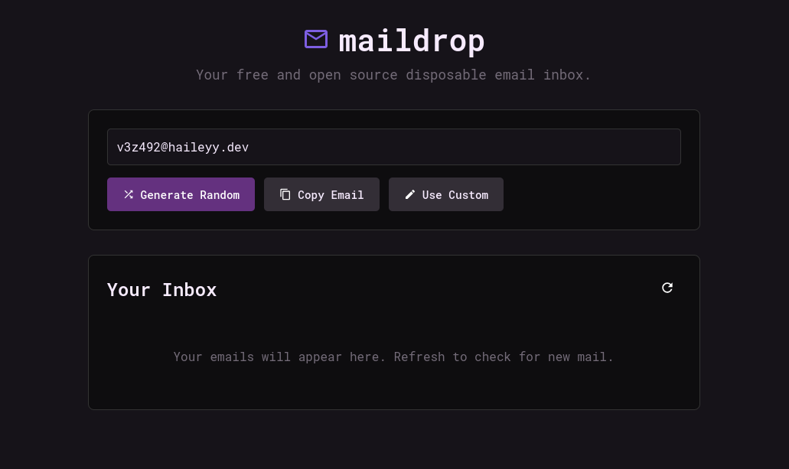

<h1>
    
    Maildrop
</h1>

Maildrop is a self hostable and easy to use disposable email service that allows you to receive emails on a random email address on your domain.  



## App Features

### Use cases

- Signing up to services without using your real email address
- Easily creating multiple accounts on services

### Features

- [x] Random email generation
- [x] Use custom emails
- [x] Support for password protected inboxes
- [x] Clean UI
- [x] Easy setup

### Planned Features

- [x] Better mobile UI
- [ ] Settings web page
- [ ] Multi domain support

## Running the application

### Prerequisites

- Python 3
- pip

### Installation and running

1.  **Clone the repository**

    ```bash
    git clone https://github.com/haileyydev/maildrop.git
    cd maildrop
    ```

2.  **Create a venv and activate it**

    ```bash
    python -m venv venv
    source venv/bin/activate
    ```

3.  **Install the requirements**

    ```bash
    pip install -r requirements.txt
    ```

4.  **Run the application**

    ```bash
    sudo python app.py
    ```

**The application must be run as root for the SMTP server to work**

### Connecting to your domain  

1. Ensure port 25 is open as this is the port the email server uses. Some ISPs block this so you may need to use a tunnel or host maildrop in the cloud.
2. Edit your domains dns settings and create an `A` record pointing to your public IP.
3. Edit your domains dns settings and create an `MX` record pointing to the domain you made your `A` record on.
4. Edit `.env` and change the domain to your domain.

### Running with docker

Use this command to run maildrop in a docker container:
```
sudo docker run \
  -d \
  --restart unless-stopped \
  --name maildrop \
  -p 5000:5000 \
  -p 25:25 \
  -e DOMAIN="yourdomain.com" \
  haileyydev/maildrop:latest  
```
Or if you prefer docker compose, Add this to your compose.yml file:
```
services:
  maildrop:
    image: haileyydev/maildrop:latest
    container_name: maildrop
    restart: unless-stopped
    ports:
      - "5000:5000"
      - "25:25"
    environment:
      - DOMAIN=yourdomain.com
```
and then start it: `sudo docker compose up -d`
